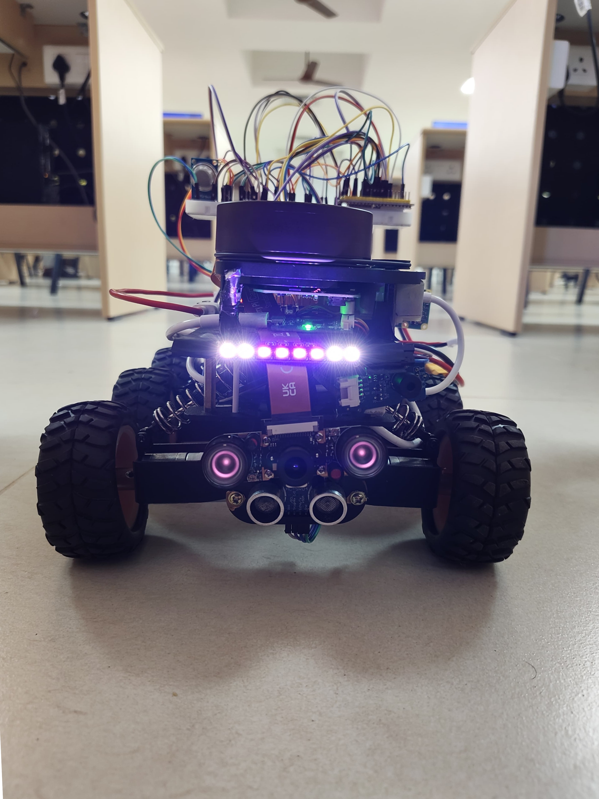
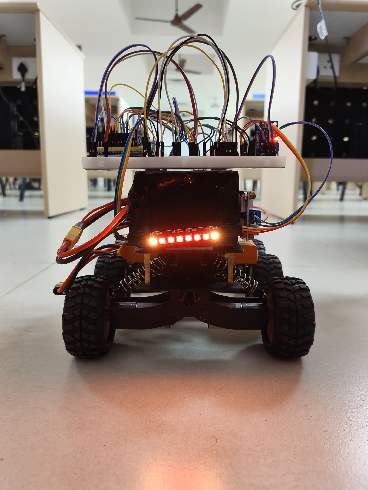
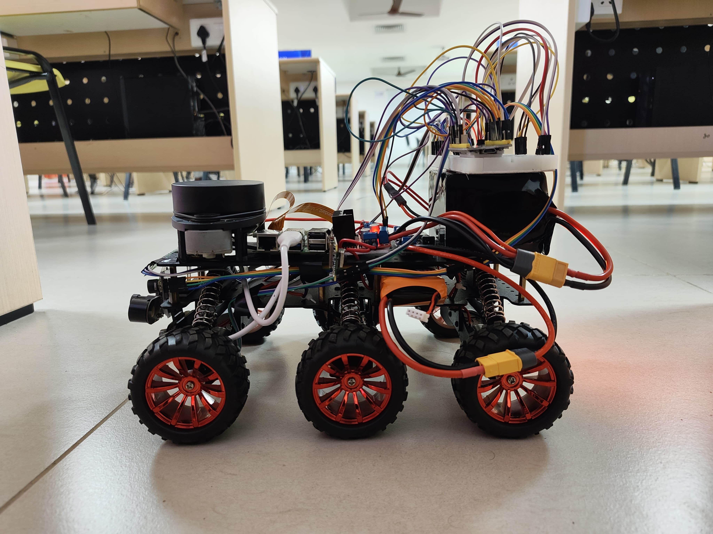
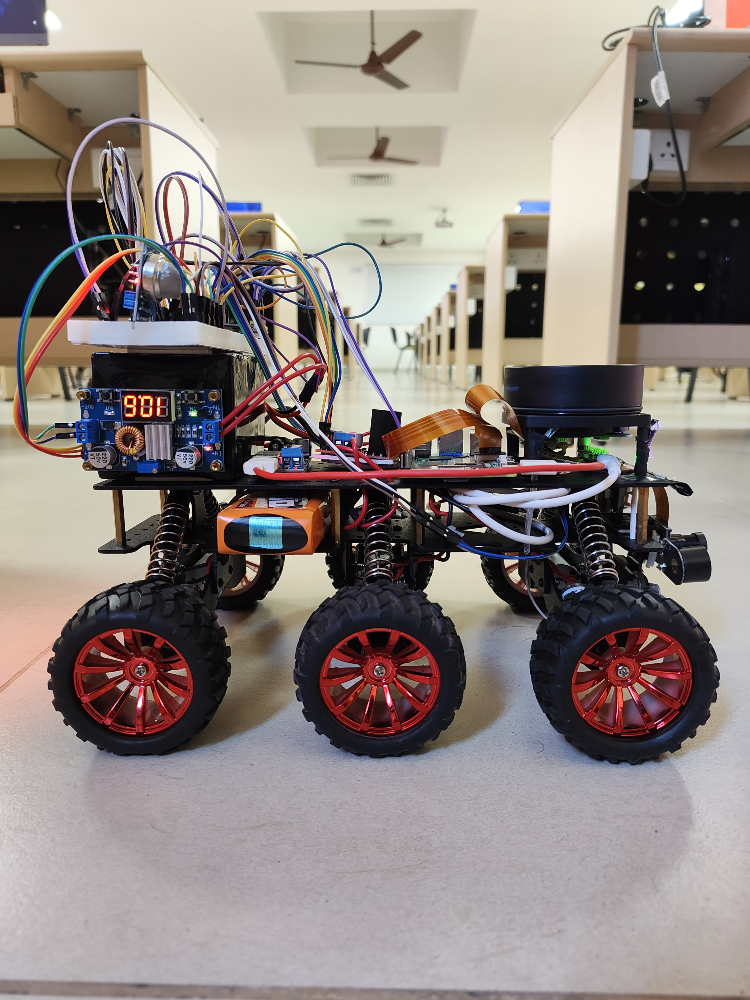
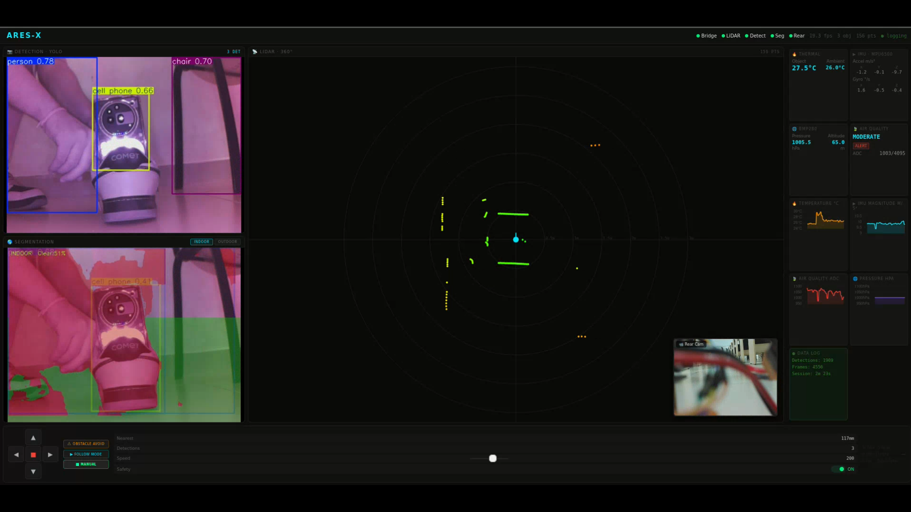

<div align="center">


# ARES-X
### Autonomous Robotic Exploration System

**A six-wheel ground rover with real-time AI vision, 360° LiDAR mapping, and multi-modal sensing — built without ROS 2.**

[](https://python.org)
[](https://fastapi.tiangolo.com)
[](https://ultralytics.com)
[](https://espressif.com)
[](https://tailscale.com)

</div>

---

## What is ARES-X?

ARES-X is a fully custom-built autonomous ground rover designed for intelligent sensing, real-time environment mapping, and remote operation in environments where human presence is impractical. Every component — from ESP32 firmware to the browser-based operator dashboard — was written and debugged by hand.

The platform deliberately avoids ROS 2 in favour of a lean, transparent pure-Python WebSocket and TCP stack. The result is a system that boots fast, fails predictably, and can be debugged with standard tools like `curl`, `websocat`, or a browser console.

---

## Rover Hardware

<div align="center">


| Front View | Rear View |
|:---:|:---:|
|  |  |
| **Left View** | **Right View** |
|  |  |

</div>

| Component | Role |
|---|---|
| Raspberry Pi 5 (8GB) | Relay services, camera streaming, LiDAR TCP relay |
| ESP32 Dev Module | Real-time motor control, sensor acquisition, autonomous modes |
| RPLiDAR A1M8 | 360° spatial mapping at 8,000 pts/sec |
| Pi NoIR Camera | Front night-vision capable vision feed |
| Pi Camera v3 | Rear wide-angle picture-in-picture |
| MLX90614 + AMG8833 | Contactless point thermal + 8×8 thermal grid |
| MPU6500 IMU | 6-axis accelerometer + gyroscope |
| BMP280 + MQ135 | Barometric pressure + air quality |
| L298N H-Bridge | Bidirectional 6WD motor drive |
| 11.1V 3S LiPo | Main power · ~45–60 min runtime |

---

## System Architecture

```mermaid
graph TB
    subgraph ROVER["🤖 ROVER HARDWARE"]
        direction TB
        ESP32["ESP32 Dev Module\nArduino C++ Firmware\n─────────────────\nMotor PWM Control\nI2C Sensor Bus\nSonar Safety Gate\nNeoPixel LEDs\nAutonomous Modes"]

        subgraph SENSORS["Sensor Suite"]
            S1["RPLiDAR A1M8\n360° · 8k pts/s"]
            S2["Pi NoIR Cam\nCAM0 · Night Vision"]
            S3["Pi Cam v3\nCAM1 · Rear View"]
            S4["MLX90614\nThermal IR · I2C 0x5A"]
            S5["AMG8833\n8×8 Thermal Grid"]
            S6["MPU6500\nIMU · I2C 0x68"]
            S7["BMP280 + MQ135\nPressure · Air Quality"]
        end

        subgraph PI["Raspberry Pi 5 — 4 Services"]
            B["ares_bridge.py\nWebSocket :8765\nSensor Relay + CMD Forward"]
            C1["camera_stream.py\nMJPEG :8766 · Pi NoIR"]
            C2["rear_stream.py\nMJPEG :8768 · Pi Cam v3"]
            L["lidar_stream.py\nTCP :8767 · LiDAR Relay"]
        end

        ESP32 -->|"UART Serial\n115200 baud"| B
        S1 --> L
        S2 --> C1
        S3 --> C2
        S4 --> ESP32
        S5 --> ESP32
        S6 --> ESP32
        S7 --> ESP32
    end

    subgraph NETWORK["🔒 TAILSCALE VPN MESH"]
        VPN["WireGuard · Encrypted\nCross-network · No port forwarding"]
    end

    subgraph LAPTOP["💻 OPERATOR LAPTOP — FastAPI Dashboard"]
        direction TB
        SCR["Shared Camera Reader Thread\nSingle MJPEG connection → raw_frame buffer"]
        DET["Detection Thread\nYOLOv8 26M · GPU · CUDA\n15–25 fps"]
        SEG["Segmentation Thread\nYOLOv8s-seg (indoor)\nYOLOP BDD100K (outdoor)"]
        LR["LiDAR Renderer\nHTML5 Canvas Polar Plot"]
        SC["Sensor Cache\nWebSocket → REST /sensors"]
        LOG["Data Logger\ndetections.csv · sensors.jsonl"]

        subgraph DASH["Browser Dashboard"]
            D1["YOLO Detection Feed"]
            D2["Segmentation Overlay"]
            D3["LiDAR 360° Map"]
            D4["Sensor Cards + Charts"]
            D5["Rear Camera PiP"]
            D6["D-pad Control Interface"]
        end

        SCR --> DET
        SCR --> SEG
        DET --> D1
        SEG --> D2
        LR --> D3
        SC --> D4
        D5 -.->|"MJPEG :8768"| C2
        DET --> LOG
        SC --> LOG
    end

    PI -->|"Tailscale VPN"| NETWORK
    NETWORK -->|"WebSocket · MJPEG · TCP"| LAPTOP
    LAPTOP -->|"Drive Commands\nWS → UART → ESP32"| NETWORK

    style ROVER fill:#1a1a2e,stroke:#e94560,color:#fff
    style LAPTOP fill:#16213e,stroke:#0f3460,color:#fff
    style NETWORK fill:#0f3460,stroke:#533483,color:#fff
    style SENSORS fill:#1a1a2e,stroke:#e94560,color:#eee
    style PI fill:#1a1a2e,stroke:#4ecca3,color:#eee
    style DASH fill:#16213e,stroke:#4ecca3,color:#eee
```



---

## Operator Dashboard




The dashboard is a single-page FastAPI application accessible from any browser on the Tailscale network — including mobile. It renders:

- **YOLO Detection Feed** — Live annotated bounding boxes at 15–25 fps (YOLOv8 26M, RTX 3050 CUDA)
- **Segmentation Panel** — Toggle between indoor free-space overlay (YOLOv8s-seg) and outdoor driveable-area detection (YOLOP / BDD100K)
- **LiDAR 360° Polar Map** — Colour-coded scan points updated at 5.5 Hz, rover centred
- **Sensor Cards + Rolling Charts** — 60-point live history for thermal, IMU magnitude, pressure, air quality
- **Rear Camera PiP** — Pi Camera v3 with software 180° flip correction
- **D-pad Control Interface** — Keyboard / on-screen with mode selection and speed slider

---

## Key Engineering Decisions

### Why Not ROS 2?

ROS 2's DDS communication layer is notoriously difficult to configure across non-standard network topologies — particularly through Tailscale. Its build system (colcon) adds significant overhead, and failure modes are opaque without deep framework knowledge.

The replacement: four small Python service scripts on the Pi, one FastAPI application on the laptop, and UART commands to the ESP32. Every communication path can be inspected with standard tools. The entire stack fits in one git repository with no build step.

### The Shared Camera Reader Thread Fix

The YOLO detection thread and segmentation thread each originally opened independent MJPEG connections to the Pi camera stream. Under this design the two threads competed for incoming TCP data — whichever was slightly slower received corrupted frames, and eventually lost its connection entirely, leaving half the vision pipeline dead.

**Fix:** A single dedicated reader thread maintains the MJPEG connection and writes each complete JPEG frame to a shared `raw_frame` buffer protected by `threading.Lock`. Consumer threads wait on a `threading.Event` signal, copy the frame, and process independently — neither ever touches the network connection. This eliminated the failure class entirely and extended stable runtime from ~10 minutes to 90+ minutes.

### IMU Direct Register Access

The GY-91 module is marketed as an MPU9250 (9-axis). Querying the `WHO_AM_I` register at init returned `0x70` — the MPU6500 identifier (6-axis, no magnetometer). The Adafruit MPU6050 library initialised the chip but `getEvent()` returned zeros for all axes due to a FIFO configuration mismatch.

**Fix:** Bypassed the library entirely. Read accelerometer data directly from registers `0x3B–0x40` and gyroscope from `0x43–0x48`, applying scale factors of 8192 LSB/g (±4G) and 65.5 LSB/°/s (±500°/s). Stable readings on every subsequent boot.

### LiDAR Serial Flush Fix

On service restart without unplugging the USB cable, the RPLiDAR library raised a descriptor mismatch error. Stale bytes from the previous session remained in the OS serial buffer and were read as the response to the new initialisation sequence.

**Fix:** One line — `serial.Serial(port).reset_input_buffer()` before passing control to the library. Made the service reliably restartable without hardware intervention.

---

## Performance Metrics

| Metric | Measured Value |
|---|---|
| YOLO Detection Rate | 15–25 fps (YOLOv8 26M, RTX 3050, CUDA) |
| Detection Confidence (typical) | 0.75–0.92 (well-lit, 1–4m range) |
| LiDAR Scan Rate | 5.5 Hz · 8,000 pts/rev |
| LiDAR Effective Indoor Range | 6–7 m consistent |
| Local Drive Command Latency | < 20 ms |
| Remote Drive Latency (Tailscale 4G) | 80–120 ms |
| Camera Stream Latency | 200–400 ms end-to-end |
| Sensor Telemetry Rate | 2s ESP32 broadcast → 1s dashboard push |
| Segmentation Model Switch Time | 0.5–1.0 s (CUDA memory cleared) |
| Battery Runtime | 45–60 min (full load) |

---

## Repository Structure

```
ARES-X/
├── esp32-firmware/          # Arduino C++ — motor control, sensors, NeoPixel, UART
├── raspberry-pi/            # Python services running on Pi 5
│   ├── ares_bridge.py       # WebSocket :8765 — sensor relay + command forwarding
│   ├── camera_stream.py     # MJPEG :8766 — Pi NoIR front camera
│   ├── rear_stream.py       # MJPEG :8768 — Pi Camera v3 rear (180° flip)
│   └── lidar_stream.py      # TCP :8767 — RPLiDAR A1M8 relay
├── laptop/                  # FastAPI dashboard + AI inference (runs on operator machine)
│   └── ares_dashboard.py    # YOLO, segmentation, LiDAR render, sensor UI, data logging
└── startup-sequence.MD      # Full startup procedure and troubleshooting guide
```

---

## Running ARES-X

See [`startup-sequence.MD`](startup-sequence.MD) for the complete procedure. Quick reference:

**On Raspberry Pi 5:**
```bash
source ~/aresx/venv/bin/activate
python3 raspberry-pi/ares_bridge.py &
python3 raspberry-pi/camera_stream.py &
python3 raspberry-pi/rear_stream.py &
python3 raspberry-pi/lidar_stream.py
```

**On Operator Laptop:**
```bash
source ~/aresx-laptop/venv/bin/activate
python3 laptop/ares_dashboard.py \
  --pi <PI_TAILSCALE_IP> \
  --model yolo26m.pt \
  --seg yolov8s-seg.pt \
  --yolop YOLOP/weights/End-to-end.pth
```

Open `http://localhost:8000` in a browser. The dashboard is also accessible from any device on the same Tailscale network using the laptop's Tailscale IP.

**ESP32 WiFi fallback:** Connect to `ARES-X` (password: `12345678`) and navigate to `192.168.4.1` for a basic drive interface when the full laptop dashboard is unavailable.

---

## Tech Stack

| Layer | Technologies |
|---|---|
| ESP32 Firmware | Arduino C++, ledcAttach PWM, Wire.h I2C, Adafruit NeoPixel |
| Raspberry Pi | Python 3.11, Picamera2, rplidar, pyserial, websockets |
| Laptop / Dashboard | Python 3.10, FastAPI, Uvicorn, Ultralytics YOLOv8, OpenCV, Chart.js |
| AI Models | YOLOv8 26M (detection), YOLOv8s-seg (indoor seg), YOLOP BDD100K (outdoor) |
| GPU Inference | CUDA 12.x, RTX 3050 4GB VRAM, PyTorch |
| Communication | UART 115200, WebSocket, MJPEG over HTTP, raw TCP |
| Remote Access | Tailscale WireGuard VPN |
| Version Control | Git — single repository, all tiers |

---

<div align="center">

**Shivansh Tripathi** · [shivansht06@gmail.com](mailto:shivansht06@gmail.com) · [LinkedIn](https://www.linkedin.com/in/shivanshtripathii/) 

*Built April 2026 · VIT Chennai · B.Tech EEE*

</div>